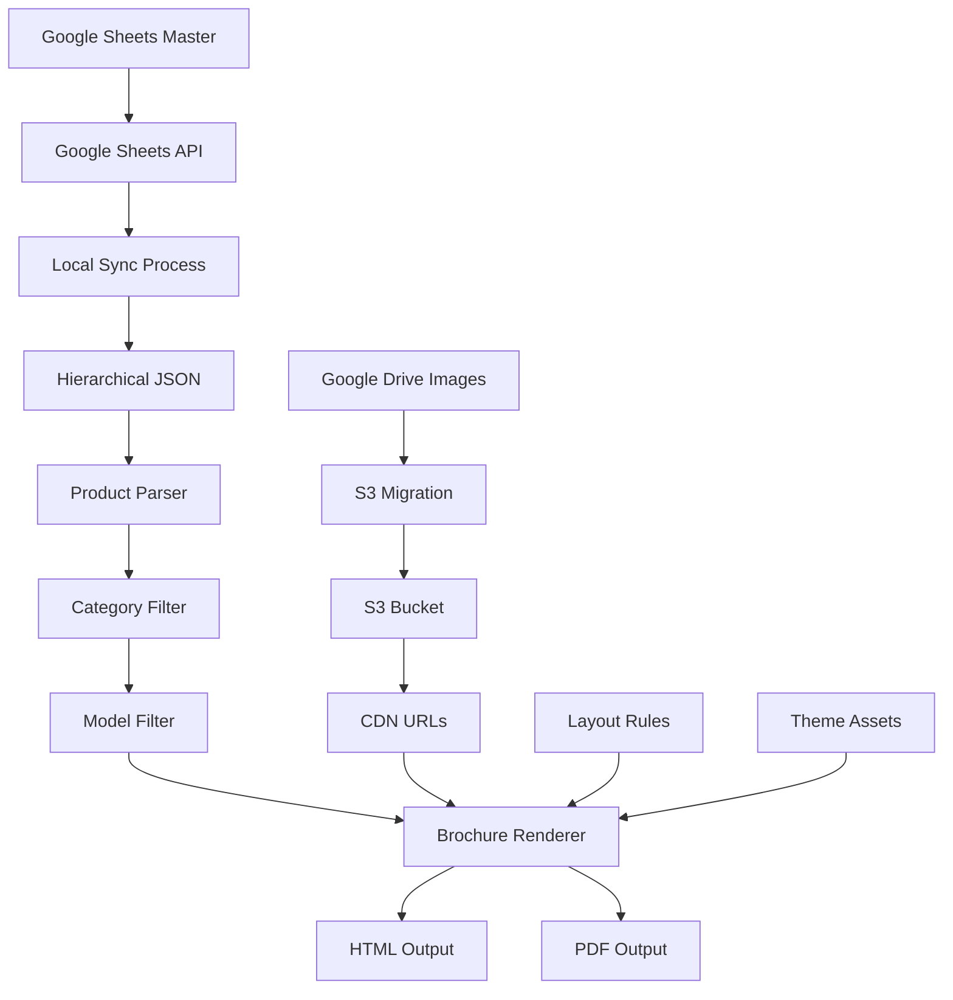
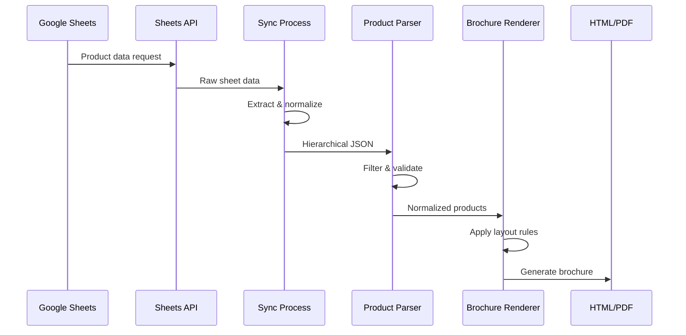
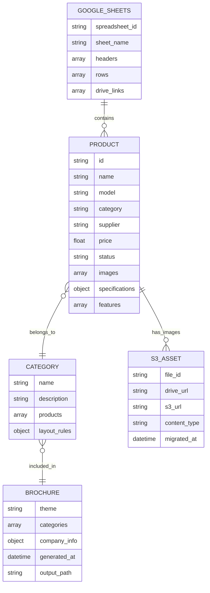

# Smart Home Product Brochure Generation System

A comprehensive Python system for generating professional product brochures and contextual usage scenario images using Google Gemini AI and AWS S3 integration.

## 🎯 Overview

This system automatically:
1. **Extracts product data** from Google Sheets and JSON files containing product specifications
2. **Generates contextual prompts** for realistic usage scenarios based on product features
3. **Creates high-quality images** using Google Gemini 2.5 Flash Image Preview model
4. **Saves images locally** with standardized naming convention (`use-case-{model_id}`)
5. **Uploads to AWS S3** (optional) with proper metadata and naming
6. **Generates professional brochures** in HTML and PDF formats

## 📁 Project Structure

```
brochure-py/
├── data/
│   ├── products_hierarchical_enhanced.json # Product data source
│   └── SMART HOME FOLLOWING PROJECT - All Products.csv
├── scripts/
│   ├── google_nano_image_generator.py      # Main AI image generation script
│   ├── google_sheets_sync.py               # Google Sheets integration
│   ├── s3_uploader.py                      # S3 upload functionality
│   ├── test_complete_system.py             # Comprehensive test suite
│   └── automated_product_processor.py      # Product data processing
├── brochure/                               # Brochure generation engine
│   ├── hierarchical_loader.py              # Product data loading
│   ├── renderer.py                         # HTML/PDF generation
│   ├── templates/                          # Jinja2 templates
│   └── static/                             # CSS, fonts, assets
├── generated_images/                       # AI-generated images output
│   ├── use-case-{model_id}.png            # Generated images
│   ├── use-case-{model_id}.json           # Image metadata
│   └── generation_report.json             # Processing summary
├── constants.md                            # Branding and development constants
└── README.md                               # This file
```

## 🚀 Quick Start

### 1. AI Image Generation (Google Gemini)

```bash
cd scripts
python3 google_nano_image_generator.py
```

This will:
- Process products from `../data/products_hierarchical_enhanced.json`
- Generate contextual usage scenario prompts
- Create realistic images using Google Gemini 2.5 Flash Image Preview
- Save results in `../generated_images/`

### 2. Generate Professional Brochures

```bash
# Generate complete brochure
python3 main.py build --src data/products_hierarchical_enhanced.json

# Category-specific brochure
python3 main.py build --categories "Security Cameras,Smart Lighting"

# Interactive mode
python3 main.py build --interactive
```

### 3. Test the Complete System

```bash
# Test image generation only
python3 test_complete_system.py

# Analyze existing generated content
python3 test_complete_system.py --analyze-only

# Show S3 configuration setup
python3 test_complete_system.py --config-only
```

### 4. Enable S3 Upload (Optional)

```bash
# Update S3 configuration in google_nano_image_generator.py
# Set ENABLE_S3_UPLOAD = True and configure AWS credentials
# Then run image generation with S3 upload
python3 google_nano_image_generator.py
```

## 🔧 Configuration

### Google Gemini API Setup

```bash
# Set your Google Gemini API key in google_nano_image_generator.py
GOOGLE_API_KEY = "your_google_gemini_api_key_here"
```

### Environment Variables

```bash
# For S3 upload functionality (optional)
export AWS_ACCESS_KEY_ID=your_access_key_id
export AWS_SECRET_ACCESS_KEY=your_secret_access_key
export AWS_DEFAULT_REGION=us-east-1

# For Google Sheets integration
export GOOGLE_SHEETS_API_KEY=your_google_sheets_api_key
```

## 📊 Generated Output

### File Naming Convention
- **Images**: `use-case-{model_id}.png`
- **Metadata**: `use-case-{model_id}.json`
- **S3 Keys**: `generated-images/use-case-{model_id}.png`
- **Brochures**: `brochure_output.html`, `brochure_output.pdf`

### Example Generated Prompt

```
Using the product shown in the reference image, create a realistic usage scenario: 
A modern smart home setup showcasing AC Hard-wire Video Doorbell in use, 
with the device prominently displayed at a front door, smartphone showing live feed, 
emphasizing key features like 2K video resolution, night vision capabilities, 
professional product photography, clean modern aesthetic, high quality, realistic lighting
```

## 🧪 Testing

### Test Modes

```bash
# Full system test (local only)
python3 test_complete_system.py

# Test with S3 upload
python3 test_complete_system.py --enable-s3 --bucket test-bucket

# Analyze existing content
python3 test_complete_system.py --analyze-only
```

## 🔌 API Integration

### Google Gemini 2.5 Flash Image Preview

The system uses Google Gemini 2.5 Flash Image Preview model for AI image generation:

- **Model**: Gemini 2.5 Flash Image Preview (multimodal capabilities)
- **Output Format**: PNG (high quality)
- **Input**: Text prompts + product reference images
- **Resolution**: 1024x1024 pixels
- **Features**: Real AI generation with product context understanding

### AWS S3 Integration (Optional)

- **Framework Ready**: S3 upload capability built-in but disabled by default
- **Configuration**: Enable via `ENABLE_S3_UPLOAD = True` in script
- **Metadata Preservation**: Product info and S3 URLs stored in JSON metadata
- **Error Handling**: Robust retry and error reporting with graceful fallbacks
- **Progress Tracking**: Detailed upload reports and status logging

### Data Flow Architecture

```
Google Sheets (Master) → API Sync → Local JSON → Parser → Renderer → HTML/PDF Output
       ↓                    ↓           ↓         ↓         ↓
   Drive Links         S3 Migration   Product   Layout   Static Assets
                                     Filtering  Rules

AI Image Generation Flow:
Product Data → Google Gemini 2.5 Flash → AI Generated Images → Local Storage → S3 Upload (Optional)
```

## Core Business Logic

### 1. AI Image Generation Pipeline

#### Google Gemini 2.5 Flash Integration (`scripts/google_nano_image_generator.py`)
- **Multimodal AI Generation**: Creates realistic usage scenario images using product context
- **Contextual Prompts**: Generates detailed prompts based on product features and specifications
- **High-Quality Output**: 1024x1024 PNG images with professional product photography aesthetics
- **Batch Processing**: Efficiently processes multiple products with error isolation

#### Key Business Rules:
- **Product Context Awareness**: AI understands product features for realistic scenario generation
- **Standardized Naming**: Images saved as `use-case-{model_id}.png` with metadata
- **Local-First Storage**: All images saved locally regardless of S3 configuration
- **Optional S3 Integration**: Framework ready but disabled by default for performance

### 2. Data Extraction & Synchronization

#### Google Sheets Integration (`scripts/google_sheets_client.py`)
- **Read-Only API Access**: Safely extracts data without modification risk
- **Automatic Structure Detection**: Identifies headers, data types, and Drive links
- **Batch Processing**: Handles large datasets efficiently
- **Error Recovery**: Graceful handling of API limits and network issues

#### Key Business Rules:
- Google Sheets serves as the **single source of truth**
- All product modifications must originate from the master sheet
- Local data is considered a **cached representation** of the master data
- Synchronization is **unidirectional** (Sheets → Local)

### 2. Asset Management Pipeline

#### Drive Link to S3 Migration (`scripts/google_sheets_sync.py`)
```
Google Drive URLs → File ID Extraction → S3 Upload → URL Replacement → Sheets Update
```

**Business Logic:**
- Extract Google Drive file IDs from product image URLs
- Migrate images to S3 for improved performance and reliability
- Maintain bidirectional mapping between Drive IDs and S3 URLs
- Update Google Sheets with new S3 URLs for future synchronization

#### Critical Constraints:
- **Image Format Standardization**: All images converted to web-optimized formats
- **CDN Performance**: S3 URLs provide faster global access than Drive links
- **Backup Strategy**: Original Drive links preserved in backup files

### 3. Data Transformation Workflow

#### Hierarchical Product Loading (`brochure/hierarchical_loader.py`)
```python
# Business Logic Flow
Raw CSV/Sheets Data → Normalization → Category Grouping → Model Filtering → Product Objects
```

**Key Transformations:**
- **Category Classification**: Products grouped by smart home categories (Security, Lighting, etc.)
- **Specification Parsing**: Technical specs converted to structured data
- **Image Processing**: Multiple image formats handled with fallback logic
- **Status Filtering**: Only active/available products included in output

#### Product Normalization (`brochure/parser.py`)
```python
class NormalizedProduct:
    id: str                    # Unique identifier
    name: str                  # Display name
    model: str                 # Model number for filtering
    supplier: str              # Manufacturer information
    category: str              # Smart home category
    price: float               # Pricing information
    status: str                # Availability status
    images: List[str]          # Image URLs (S3 or fallback)
    specifications: Dict       # Technical specifications
    features: List[str]        # Key features list
```

### 4. Brochure Generation Engine

#### Layout Rules & Rendering (`brochure/renderer.py`)
```
Product Data → Template Selection → Layout Application → Asset Integration → HTML Generation
                    ↓
            AI Generated Images (Optional)
```

**Business Rules:**
- **Luxury Design Standards**: High-end visual presentation for professional use
- **Responsive Layouts**: Optimized for both digital viewing and print output
- **Brand Consistency**: HeyZack branding and color schemes enforced
- **Category-Based Organization**: Products grouped logically for easy navigation
- **AI Image Integration**: Support for AI-generated usage scenario images

#### Template System:
- **Jinja2 Templates**: Flexible, maintainable template structure
- **Theme Support**: Multiple visual themes (luxury-dark, etc.)
- **Custom Filters**: Currency formatting, text truncation, image optimization
- **Dynamic Asset Loading**: Supports both traditional product images and AI-generated scenarios

## Visual Documentation

### System Architecture Flowchart



### Data Flow Sequence Diagram



### Entity Relationship Diagram



## Developer Guidance

### Critical Integration Points

#### 1. Google Sheets API Integration

**Authentication & Access:**
```python
# Required: Google Sheets API v4 key
API_KEY = "your_api_key_here"
client = GoogleSheetsClient(API_KEY)

# Extract spreadsheet ID from URL
spreadsheet_id = client.extract_spreadsheet_id(sheets_url)

# Read data with error handling
try:
    data = client.get_sheet_data(spreadsheet_id, "All Products")
except requests.exceptions.RequestException as e:
    logger.error(f"API request failed: {e}")
```

**Business Rules:**
- API key must have read access to the target spreadsheet
- Rate limiting: Maximum 100 requests per 100 seconds per user
- Data validation required for all extracted content
- Fallback mechanisms for API failures

#### 2. Data Processing Constraints

**Product Validation Rules:**
```python
# Required fields for valid products
REQUIRED_FIELDS = ['id', 'name', 'model', 'category', 'status']

# Status filtering
VALID_STATUSES = ['active', 'available', 'in_stock']

# Image URL validation
def validate_image_url(url: str) -> bool:
    return url and (url.startswith('https://s3.') or url.startswith('https://drive.google.com'))
```

**Edge Cases:**
- **Missing Images**: Fallback to placeholder or skip product
- **Invalid Specifications**: Log warning and use empty dict
- **Duplicate IDs**: Use first occurrence, log conflict
- **Category Mismatch**: Auto-assign to "Uncategorized"

#### 3. Brochure Update Process

**Workflow Triggers:**
```bash
# Manual generation
python3 main.py build --src data/products_hierarchical_enhanced.json

# Category-specific generation
python3 main.py build --categories "Security Cameras,Smart Lighting"

# Interactive mode
python3 main.py build --interactive
```

**Update Mechanisms:**
1. **Full Regeneration**: Complete rebuild from Google Sheets data
2. **Incremental Updates**: Modified products only (future enhancement)
3. **Category Filtering**: Selective brochure generation
4. **Asset Synchronization**: S3 URL updates without full rebuild

### Performance Considerations

**Optimization Strategies:**
- **Caching**: Local JSON cache reduces API calls
- **Batch Processing**: Multiple products processed simultaneously
- **Asset CDN**: S3 URLs provide faster image loading
- **Template Compilation**: Jinja2 templates cached for reuse
- **AI Generation Efficiency**: Google Gemini 2.5 Flash optimized for batch processing
- **Local-First Storage**: Reduces dependency on cloud services for core functionality

**Monitoring Points:**
- Google Sheets API quota usage
- Google Gemini API usage and rate limits
- S3 bandwidth and storage costs (when enabled)
- AI image generation time and success rates
- Brochure generation time
- Output file sizes

### Error Handling & Recovery

**Critical Error Scenarios:**
1. **Google Sheets API Failure**: Use cached local data
2. **Google Gemini API Failure**: Log errors and continue with remaining products
3. **S3 Asset Unavailable**: Fallback to Drive links or placeholders
4. **Template Rendering Error**: Log error and skip problematic product
5. **Invalid Product Data**: Validation warnings with graceful degradation
6. **AI Generation Failure**: Individual product isolation prevents batch failure

**Recovery Procedures:**
```python
# Backup strategy implementation
backup_manager = BackupManager()
backup_manager.create_backup()  # Before major operations
backup_manager.restore_backup() # On critical failure

# AI generation error handling
for product in products:
    try:
        generate_ai_image(product)
    except Exception as e:
        logger.error(f"AI generation failed for {product.id}: {e}")
        continue  # Process remaining products
```

## Integration Workflow Summary

1. **Data Source**: Google Sheets serves as master product database
2. **Synchronization**: Automated sync process extracts and normalizes data
3. **AI Image Generation**: Google Gemini 2.5 Flash creates contextual usage scenarios
4. **Asset Management**: Images migrated from Drive to S3 for performance (optional)
5. **Processing**: Products filtered, validated, and organized by category
6. **Generation**: HTML/PDF brochures created with luxury design standards
7. **Output**: Professional-grade catalogs with AI-enhanced visuals ready for distribution

This architecture ensures **data integrity**, **AI-enhanced content generation**, **performance optimization**, and **maintainable code structure** while providing stakeholders with an intuitive interface for product management through Google Sheets and automated visual content creation.