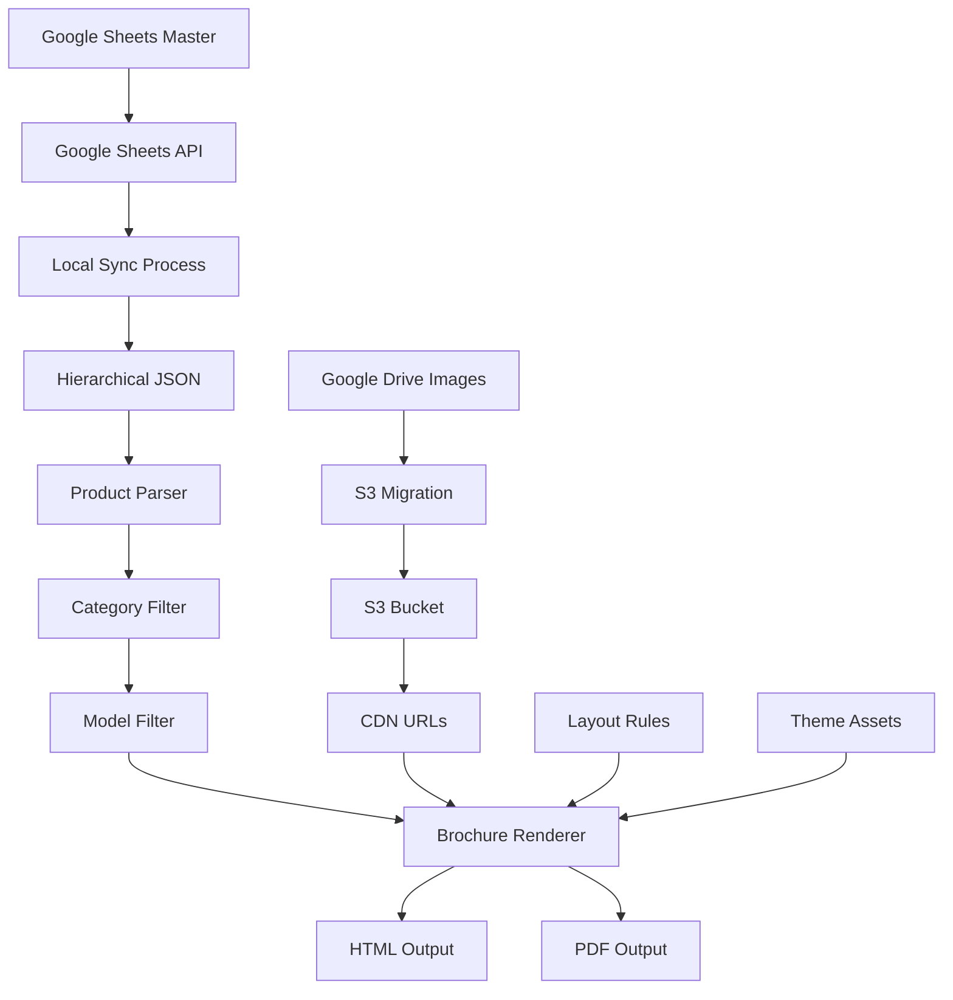
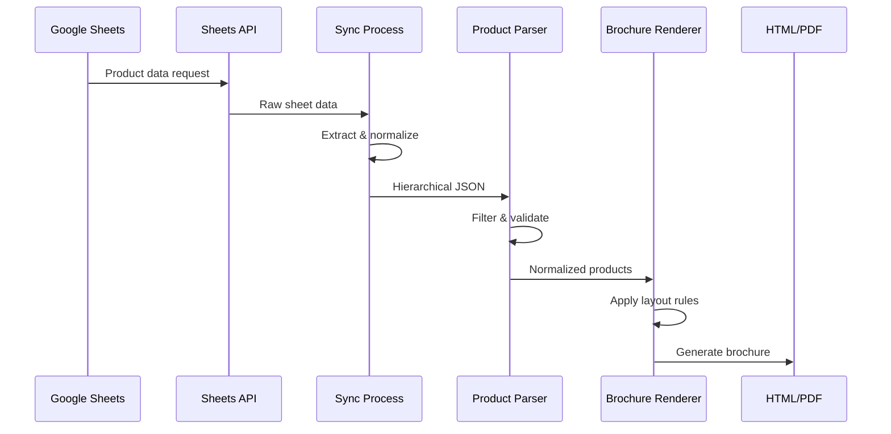
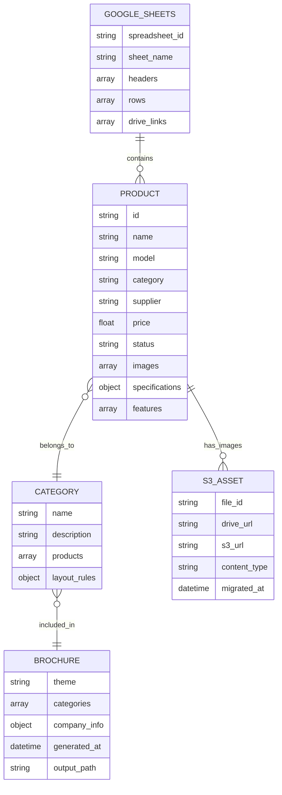

# HeyZack Brochure Generator - System Architecture & Business Logic

## System Overview

### Central Data Source: Google Sheets as Single Source of Truth

The HeyZack Brochure Generator operates on a **Google Sheets-centric architecture** where all product data originates from and is synchronized with a master Google Sheets document. This design ensures data consistency and provides a user-friendly interface for non-technical stakeholders to manage product information.

**Key Components:**
- **Google Sheets Master Document**: Authoritative source containing product specifications, images, and metadata
- **Local Data Pipeline**: Hierarchical JSON structure optimized for brochure generation
- **S3 Asset Management**: Cloud-based image storage with automated synchronization
- **HTML/PDF Brochure Engine**: Luxury-grade output generation with responsive layouts

### Data Flow Architecture

```
Google Sheets (Master) → API Sync → Local JSON → Parser → Renderer → HTML/PDF Output
       ↓                    ↓           ↓         ↓         ↓
   Drive Links         S3 Migration   Product   Layout   Static Assets
                                     Filtering  Rules
```

## Core Business Logic

### 1. Data Extraction & Synchronization

#### Google Sheets Integration (`scripts/google_sheets_client.py`)
- **Read-Only API Access**: Safely extracts data without modification risk
- **Automatic Structure Detection**: Identifies headers, data types, and Drive links
- **Batch Processing**: Handles large datasets efficiently
- **Error Recovery**: Graceful handling of API limits and network issues

#### Key Business Rules:
- Google Sheets serves as the **single source of truth**
- All product modifications must originate from the master sheet
- Local data is considered a **cached representation** of the master data
- Synchronization is **unidirectional** (Sheets → Local)

### 2. Asset Management Pipeline

#### Drive Link to S3 Migration (`scripts/google_sheets_sync.py`)
```
Google Drive URLs → File ID Extraction → S3 Upload → URL Replacement → Sheets Update
```

**Business Logic:**
- Extract Google Drive file IDs from product image URLs
- Migrate images to S3 for improved performance and reliability
- Maintain bidirectional mapping between Drive IDs and S3 URLs
- Update Google Sheets with new S3 URLs for future synchronization

#### Critical Constraints:
- **Image Format Standardization**: All images converted to web-optimized formats
- **CDN Performance**: S3 URLs provide faster global access than Drive links
- **Backup Strategy**: Original Drive links preserved in backup files

### 3. Data Transformation Workflow

#### Hierarchical Product Loading (`brochure/hierarchical_loader.py`)
```python
# Business Logic Flow
Raw CSV/Sheets Data → Normalization → Category Grouping → Model Filtering → Product Objects
```

**Key Transformations:**
- **Category Classification**: Products grouped by smart home categories (Security, Lighting, etc.)
- **Specification Parsing**: Technical specs converted to structured data
- **Image Processing**: Multiple image formats handled with fallback logic
- **Status Filtering**: Only active/available products included in output

#### Product Normalization (`brochure/parser.py`)
```python
class NormalizedProduct:
    id: str                    # Unique identifier
    name: str                  # Display name
    model: str                 # Model number for filtering
    supplier: str              # Manufacturer information
    category: str              # Smart home category
    price: float               # Pricing information
    status: str                # Availability status
    images: List[str]          # Image URLs (S3 or fallback)
    specifications: Dict       # Technical specifications
    features: List[str]        # Key features list
```

### 4. Brochure Generation Engine

#### Layout Rules & Rendering (`brochure/renderer.py`)
```
Product Data → Template Selection → Layout Application → Asset Integration → HTML Generation
```

**Business Rules:**
- **Luxury Design Standards**: High-end visual presentation for professional use
- **Responsive Layouts**: Optimized for both digital viewing and print output
- **Brand Consistency**: HeyZack branding and color schemes enforced
- **Category-Based Organization**: Products grouped logically for easy navigation

#### Template System:
- **Jinja2 Templates**: Flexible, maintainable template structure
- **Theme Support**: Multiple visual themes (luxury-dark, etc.)
- **Custom Filters**: Currency formatting, text truncation, image optimization

## Visual Documentation

### System Architecture Flowchart



### Data Flow Sequence Diagram



### Entity Relationship Diagram



## Developer Guidance

### Critical Integration Points

#### 1. Google Sheets API Integration

**Authentication & Access:**
```python
# Required: Google Sheets API v4 key
API_KEY = "your_api_key_here"
client = GoogleSheetsClient(API_KEY)

# Extract spreadsheet ID from URL
spreadsheet_id = client.extract_spreadsheet_id(sheets_url)

# Read data with error handling
try:
    data = client.get_sheet_data(spreadsheet_id, "All Products")
except requests.exceptions.RequestException as e:
    logger.error(f"API request failed: {e}")
```

**Business Rules:**
- API key must have read access to the target spreadsheet
- Rate limiting: Maximum 100 requests per 100 seconds per user
- Data validation required for all extracted content
- Fallback mechanisms for API failures

#### 2. Data Processing Constraints

**Product Validation Rules:**
```python
# Required fields for valid products
REQUIRED_FIELDS = ['id', 'name', 'model', 'category', 'status']

# Status filtering
VALID_STATUSES = ['active', 'available', 'in_stock']

# Image URL validation
def validate_image_url(url: str) -> bool:
    return url and (url.startswith('https://s3.') or url.startswith('https://drive.google.com'))
```

**Edge Cases:**
- **Missing Images**: Fallback to placeholder or skip product
- **Invalid Specifications**: Log warning and use empty dict
- **Duplicate IDs**: Use first occurrence, log conflict
- **Category Mismatch**: Auto-assign to "Uncategorized"

#### 3. Brochure Update Process

**Workflow Triggers:**
```bash
# Manual generation
python3 main.py build --src data/products_hierarchical_enhanced.json

# Category-specific generation
python3 main.py build --categories "Security Cameras,Smart Lighting"

# Interactive mode
python3 main.py build --interactive
```

**Update Mechanisms:**
1. **Full Regeneration**: Complete rebuild from Google Sheets data
2. **Incremental Updates**: Modified products only (future enhancement)
3. **Category Filtering**: Selective brochure generation
4. **Asset Synchronization**: S3 URL updates without full rebuild

### Performance Considerations

**Optimization Strategies:**
- **Caching**: Local JSON cache reduces API calls
- **Batch Processing**: Multiple products processed simultaneously
- **Asset CDN**: S3 URLs provide faster image loading
- **Template Compilation**: Jinja2 templates cached for reuse

**Monitoring Points:**
- Google Sheets API quota usage
- S3 bandwidth and storage costs
- Brochure generation time
- Output file sizes

### Error Handling & Recovery

**Critical Error Scenarios:**
1. **Google Sheets API Failure**: Use cached local data
2. **S3 Asset Unavailable**: Fallback to Drive links or placeholders
3. **Template Rendering Error**: Log error and skip problematic product
4. **Invalid Product Data**: Validation warnings with graceful degradation

**Recovery Procedures:**
```python
# Backup strategy implementation
backup_manager = BackupManager()
backup_manager.create_backup()  # Before major operations
backup_manager.restore_backup() # On critical failure
```

## Integration Workflow Summary

1. **Data Source**: Google Sheets serves as master product database
2. **Synchronization**: Automated sync process extracts and normalizes data
3. **Asset Management**: Images migrated from Drive to S3 for performance
4. **Processing**: Products filtered, validated, and organized by category
5. **Generation**: HTML/PDF brochures created with luxury design standards
6. **Output**: Professional-grade catalogs ready for distribution

This architecture ensures **data integrity**, **performance optimization**, and **maintainable code structure** while providing stakeholders with an intuitive interface for product management through Google Sheets.